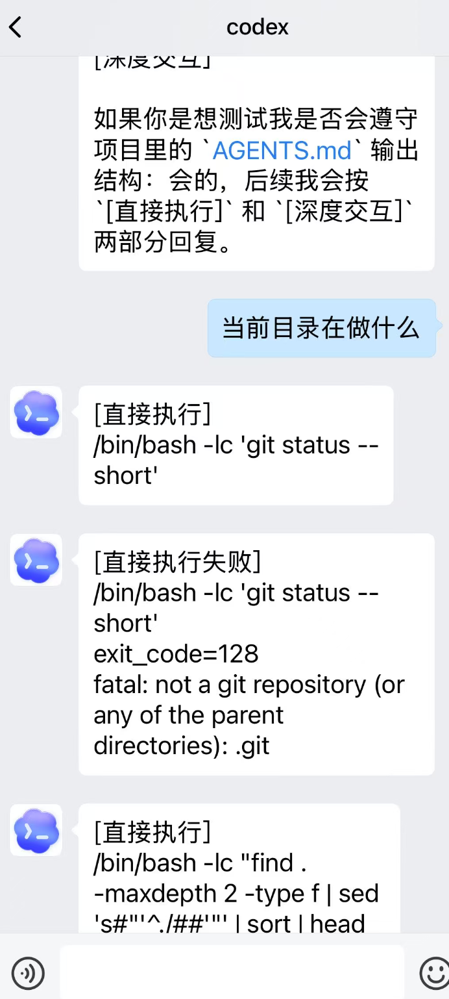
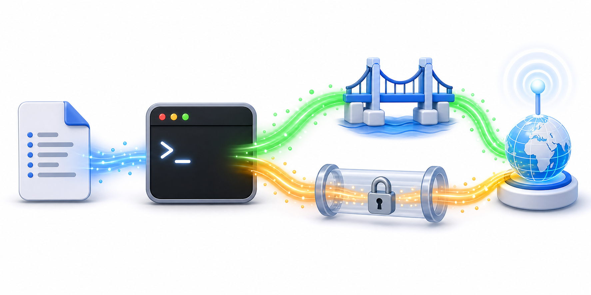

# WeCom Codex Bridge

把企业微信自建应用接到你本机的 Codex remote-control。配置完成后，你可以在手机企业微信里给 Codex 发消息，Codex 在你的电脑上继续同一个 thread 工作，再把结果发回手机。

## 效果预览

部署完成后，可以直接在企业微信里和本机 Codex 对话：

<p align="center">
  
</p>

## 架构示意

整体链路：

<p align="center">
  
</p>

多台电脑独立部署时，可以在同一台 VPS 上用不同 callback path 和端口分流：

<p align="center">
  
</p>

启动脚本会读取本地配置，同时拉起 bridge 和 SSH 反向隧道：

<p align="center">
  
</p>

## 工作流程

```text
手机企业微信
  -> 企业微信服务器
  -> 你的 VPS:80 /wecom/callback
  -> VPS 上的 Nginx
  -> VPS 127.0.0.1:9800
  -> SSH 反向隧道
  -> 你电脑上的 127.0.0.1:8000
  -> wecom_bridge.py
  -> codex app-server --listen stdio://
  -> Codex 在你的电脑上执行任务
```

几个重要概念：

- 企业微信自建应用：手机上的聊天入口，用来收发消息。
- VPS：有公网 IP 的服务器，企业微信只能把回调发到公网地址。
- Nginx：VPS 上的 HTTP 入口，只处理 `/wecom/callback`。
- SSH 反向隧道：让 VPS 能把企业微信回调转回你的电脑。
- bridge：本项目的 Python 服务，负责企业微信和 Codex 之间的消息转换。
- Codex thread：Codex 的一个会话上下文。`/resume` 可以切换历史 thread。
- Codex turn：thread 里的一轮任务。普通文本通常是在当前 thread 里新开一个 turn。

Codex app-server 只在你的电脑上启动，不直接暴露到公网。

## 当前限制

- 只支持企业微信文本消息。
- 还没有完整的手机端审批 UI。如果启用 `on-request` 审批，Codex 可能等待你回到电脑端处理。
- `/status`、`/resume` 等是通过 Codex remote-control 近似适配，不是直接执行 Codex TUI 原版 slash UI。


## 前置条件

你需要准备：

```text
1. 一台能运行 Codex 的本机电脑
2. 本机已安装codex，登录并能正常使用 codex 命令
3. Python 3.10 或更新版本
4. 一个企业微信自建应用（容易实现，请自行在企业微信注册）
5. 一台有公网 IP 的 VPS
6. VPS 上安装 Nginx
7. 本机能 SSH 登录 VPS
```

先在本机确认 Codex 可用：

```bash
codex --version
codex app-server --help
```

如果 `codex` 命令不存在，先安装并登录 Codex，再继续配置本项目。

## 第一步：安装本机依赖

进入项目目录：

```bash
cd wecom-codex-bridge
```

安装 Python 依赖：

```bash
python3 -m pip install -r requirements.txt
```

复制配置文件：

```bash
cp config.example.env config.local.env
```

`config.local.env` 会放真实密钥，不要提交到 GitHub。

## 第二步：填写企业微信配置

在企业微信管理后台创建自建应用后，找到以下字段并在config中填写：

```text
WECOM_CORP_ID=企业ID
WECOM_CORP_SECRET=自建应用Secret
WECOM_AGENT_ID=自建应用AgentId
WECOM_TO_USER=你的企业微信UserID
```

然后在企业微信自建应用的“接收消息服务器”里准备：

```text
URL: http://你的VPS公网IP/wecom/callback
Token: 点击企业微信页面中的按钮生成一个字符串，并填到 WECOM_TOKEN
EncodingAESKey: 企业微信页面生成的 43 位 EncodingAESKey，填到 WECOM_ENCODING_AES_KEY
```

对应配置：

```text
WECOM_TOKEN=和企业微信后台一致
WECOM_ENCODING_AES_KEY=和企业微信后台一致
```

第一次保存企业微信回调时，bridge 必须已经启动并且公网链路已通，否则企业微信会提示回调验证失败。

## 第三步：填写 Codex 配置

最重要的是工作目录：

```text
CODEX_WORKDIR=/absolute/path/to/your/project
```

这个目录就是手机发来的任务默认在哪个项目里执行。请使用绝对路径，例如：

```text
CODEX_WORKDIR=/absolute/path/to/your/project
```

常用默认值：

```text
CODEX_BACKEND=codex_remote_control
CODEX_TIMEOUT_SECONDS=1800
CODEX_THREAD_LIST_LIMIT=20
BRIDGE_COMMAND_PREFIX=!
```

## 第四步：安全配置

默认配置：

```text
CODEX_REMOTE_APPROVAL_POLICY=never
CODEX_REMOTE_SANDBOX=danger-full-access
```

含义：

```text
never               不让 Codex 再请求审批
danger-full-access 允许 Codex 在本机完整访问文件和执行命令
```

这适合你自己控制自己的可信电脑，但风险很高。别人拿到你的企业微信应用权限后，就可能远程让 Codex 在你的机器上执行任务。

更保守的只读配置：

```text
CODEX_REMOTE_APPROVAL_POLICY=on-request
CODEX_REMOTE_SANDBOX=read-only
```

含义：

```text
on-request  Codex 需要执行命令或改文件时请求审批
read-only   Codex 只能读取文件，不能直接写文件
```

中间模式：

```text
CODEX_REMOTE_APPROVAL_POLICY=on-request
CODEX_REMOTE_SANDBOX=workspace-write
```

含义：

```text
workspace-write 允许 Codex 在工作区写文件，但敏感动作仍可能请求审批
```

注意：当前 bridge 并未实现完整手机端审批流程。启用 `on-request` 后，Codex 可能会等待审批；这时你需要回到电脑端处理，或者后续自行扩展企业微信审批适配。

## 第五步：配置 VPS Nginx

在 VPS 上安装 Nginx：

```bash
sudo apt update
sudo apt install nginx
```

把本仓库里的示例配置复制到 VPS：

```bash
sudo cp nginx/wecom-callback.conf /etc/nginx/sites-available/wecom-callback
sudo rm -f /etc/nginx/sites-enabled/default
sudo ln -sf /etc/nginx/sites-available/wecom-callback /etc/nginx/sites-enabled/wecom-callback
sudo nginx -t
sudo systemctl reload nginx
```

这个 Nginx 配置只处理：

```text
/wecom/callback
```

其他路径返回 `404`。

VPS 防火墙至少需要允许：

```text
80/tcp   企业微信回调访问
22/tcp   或你的 SSH 登录端口
```

## 第六步：配置 SSH 反向隧道

在 `config.local.env` 里填写：

```text
VPS_HOST=你的VPS公网IP或域名
VPS_USER=你的VPS登录用户名
VPS_SSH_PORT=22
VPS_REMOTE_HOST=127.0.0.1
VPS_REMOTE_PORT=9800
LOCAL_FORWARD_HOST=127.0.0.1
LOCAL_FORWARD_PORT=8000
```

含义：

```text
VPS 127.0.0.1:9800
  -> 通过 SSH 反向隧道
  -> 本机 127.0.0.1:8000
```

如果本机 SSH 到 VPS 必须走 HTTP 代理，例如 WSL 通过 Windows 代理出网，填写：

```text
SSH_PROXY_URL=http://host:port
```

如果不需要代理，保持为空：

```text
SSH_PROXY_URL=
```

## 第七步：启动

在本机运行：

```bash
bash scripts/start.sh
```

脚本默认读取仓库根目录的 `config.local.env`。如果需要使用其他配置文件，可以显式传入路径：

```bash
bash scripts/start.sh path/to/your.env
```

脚本会启动两件事：

```text
1. 本机 bridge: http://127.0.0.1:8000
2. SSH 反向隧道: VPS 127.0.0.1:9800 -> 本机 127.0.0.1:8000
```

如果 SSH 需要密码，直接在当前终端输入。

脚本会一直在前台运行。停止时按：

```text
Ctrl+C
```

它会同时停止 bridge、Codex app-server 子进程和 SSH 隧道。

## 第八步：验证

本机健康检查：

```bash
curl --noproxy '*' -i http://127.0.0.1:8000/health
```

正常会看到：

```text
ok
backend=codex_remote_control
```

公网 callback 检查：

```bash
curl -i http://你的VPS公网IP/wecom/callback
```

正常应返回 `400`。这是好结果，因为手工 curl 没有企业微信签名。它说明公网请求已经到达 bridge。

然后回到企业微信后台保存“接收消息服务器”。保存成功后，在手机企业微信里给自建应用发送：

```text
!status
```

如果手机收到 `bridge ok`，说明整条链路已经通了。

## 手机端怎么用

直接发普通文本，就是让 Codex 在当前 thread 里处理任务：

```text
帮我解释这个项目的入口文件
把 README 的安装步骤写清楚
继续
```

Bridge 管理命令使用 `!` 前缀：

```text
!status             查看 bridge、当前 thread、active turn、队列、cwd
!thread             查看当前绑定的 Codex thread id
!threads            列出最近 Codex threads，回复数字即可绑定
!bind <thread_id>   手动绑定指定 thread
!new                新建 Codex thread
!fork               fork 当前 thread，并切换到 fork 后的新 thread
!rename <name>      重命名当前 thread
!archive            归档当前 thread，并清除当前绑定
!unarchive <id>     取消归档指定 thread，并绑定到它
!rollback [n]       回退当前 thread 最近 n 个 turn，默认 1
!cwd                查看当前 thread cwd 和默认新 thread cwd
!cd <path>          切换默认 cwd，并在该目录新建 thread
!cd reset           清除 cwd 覆盖，回到 CODEX_WORKDIR 并新建 thread
!stop               打断当前 active turn
!continue [text]    继续当前 thread；不带 text 时发送“继续”
!queue              查看队列和 active turn
!last [n]           查看 Codex 历史，默认 3，最多 10
!tail [n]           查看 bridge 最近发到手机的消息，默认 10，最多 50
```

Codex slash 命令使用 `/`：

```text
/        列出当前 Codex slash 命令
/status  查看 Codex thread 状态
/new     新建 Codex thread
/resume  列出最近 Codex threads，回复数字即可绑定
/fork    fork 当前 thread
/rename <name>  重命名当前 thread
/archive 归档当前 thread
/unarchive <id> 取消归档指定 thread
/rollback [n] 回退当前 thread 最近 n 个 turn，默认 1
/goal    查看当前 goal
/goal <text>  设置当前 long-running goal
/goal clear   清除当前 goal
/compact 启动 Codex compact
/model   列出模型，回复数字后继续选择推理强度
```

`!` 和 `/` 的区别：

```text
!xxx  bridge 管理命令，偏运维和故障排查
/xxx  Codex slash 命令适配，偏 Codex 使用习惯
```

例如：

```text
!status 看 bridge 自己是否正常
/status 看当前 Codex thread 的状态摘要
```

## 普通文本路由逻辑

手机里直接发送普通文本时，bridge 会根据当前 Codex 状态决定怎么送。

### Codex 空闲

如果当前没有 active turn：

```text
手机普通文本
-> bridge 调用 turn/start
-> 在当前绑定的 thread 里新开一个 turn
-> bridge 后台等待 Codex 输出
-> 最终答案发回手机
```

这里的“新开 turn”不是“新开 thread”。thread 是一整段会话；turn 是这段会话里的一轮任务。只有 `/new`、`!new`、`/resume`、`!threads` 这类命令才会改变当前 thread。

### Codex 忙碌

如果当前已有 active turn，说明 Codex 还在处理上一条任务。这时你继续发普通文本：

```text
手机普通文本
-> bridge 调用 turn/steer
-> 文本插入当前 active turn
-> 不新开 thread，也不新开独立任务
```

这适合在 Codex 正在做事时补充要求：

```text
顺便把 README 也改了
不要动 release 目录
刚才那个方案先暂停，改成只读分析
```

Codex 可能在 `turn/steer` 后返回新的 active turn id。bridge 会同步这个最新 turn id，所以之后 `!status` 和 `!stop` 会指向最新 active turn。

### Codex 正在打断

如果你刚发过 `!stop`，bridge 会把当前 active turn 标记为 interrupting。在打断完成前，你再发普通文本：

```text
bridge 不会立刻转发给 Codex
手机收到提示：稍后重发
```

等手机收到 `Codex interrupted`，或 `!status` 显示：

```text
active_turn=(none)
```

再发送新任务。

## 输出规则

长任务期间会推送精简过程：

```text
[计划更新]      Codex plan 更新
[直接执行]      Codex 正在执行命令；长命令和多行脚本只显示摘要
[直接执行失败]  失败命令摘要、退出码和尾部输出
[网络搜索]      web search query
[工具调用]      MCP/dynamic tool 名称
[文件修改]      patch 触及的文件
[文件变更]      最终 diff 摘要
[警告]          Codex 警告
```

普通 commentary 不转发到手机，避免刷屏。命令大输出也不转发，除非命令失败。

## 常见问题

### 企业微信后台保存回调失败

检查：

```text
1. scripts/start.sh 是否正在运行
2. VPS 的 80 端口是否开放
3. Nginx 是否已 reload
4. http://你的VPS公网IP/wecom/callback 是否返回 400
5. WECOM_TOKEN 和 WECOM_ENCODING_AES_KEY 是否和企业微信后台一致
```

### 手机能发消息，但收不到主动回复

先发：

```text
!status
```

如果手机能收到 `bridge ok`，说明企业微信回调和 bridge 正常。再检查企业微信后台“企业可信 IP”，把企业微信报错里的 `from ip` 加进去。

### Codex 回复 reconnecting

这通常不是企业微信问题，而是本机 Codex app-server 访问 OpenAI/ChatGPT 后端不稳定。检查本机代理、`HTTPS_PROXY`、`HTTP_PROXY`、`ALL_PROXY`、`NO_PROXY` 等环境变量。

### `!stop` 报 active turn id 不一致

新版 bridge 会同步 `turn/steer` 返回的最新 turn id，并在 interrupt mismatch 时自动重试。遇到这个问题请先更新到最新版并重启 `scripts/start.sh`。
